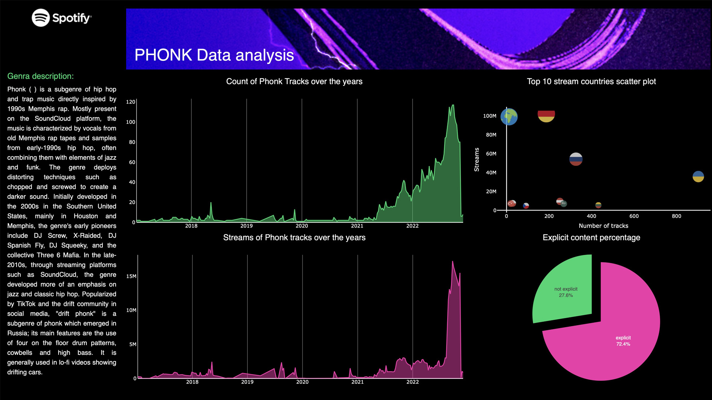

# Spotify Phonk Analysis Dashboard

## Tools used:
- Plotly
- Dash
- Pandas
- Python

## Preview:

## Description:
As a music lover, I've been listening to Phonk music for quite some time now, especially during my gym sessions 💪. 

I wanted to dive deeper into the data behind this genre on Spotify and learn more about Dash and Plotly, a powerful data visualization library.

I created a dashboard to analyze Phonk music on Spotify, focusing on the following aspects:
- Yearly count of Phonk tracks 
- Streams of Phonk tracks over the years
- Relationship between the number of tracks released and streams by country
- Percentage of explicit content in Phonk music

Not only was this project a fun way to dive deeper into the world of Phonk music, but it also allowed me to improve my skills in data analysis and visualization using Dash and Plotly.

## To run using Docker

`docker build -t phonk-spotify .`

`docker run -p 8000:8000 phonk-spotify`
